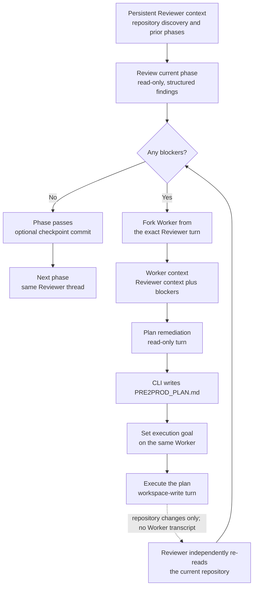

# Pre2prod 💩→🍭

From vibe-coded PoC to production-ready MVP.

> Thousands of new products are vibe-coded every day,
> but only a small fraction ever reach production.

Pre2Prod closes that gap with a carefully designed,
best-practice workflow that progressively restructures,
validates, tests, hardens, and prepares a repository
for deployment — almost automatically.

**One command. A sequence of expert reviews. A repository prepared for real staging.**

Pre2prod is a TypeScript CLI that uses Codex to improve an existing repository
through a simple reviewer-led loop. One phase runs as follows:



## Status

This is a hackathon MVP scaffold. The orchestration, App Server client, prompts, Git checkpoints, explicit-only Codex Skill at `.agents/skills/pre2prod/`, mocks, and automated tests are implemented. Live compatibility still needs to be verified against the installed Codex CLI version.

## Requirements

- Node.js >=20.19.0
- Corepack-managed pnpm 10.14.0 (the version pinned in `packageManager`)
- an installed and authenticated Codex CLI with `codex app-server`

## Install and run

```bash
corepack enable
pnpm install --frozen-lockfile
pnpm run build
node dist/cli.js
```

After publishing:

```bash
npx --yes pre2prod
```

Optional free-form direction:

```bash
npx --yes pre2prod \
  "Prefer Railway, preserve the monolith, and avoid paid services"
```

## Built-in review phases

### Foundation

- Immediate Risk Triage
- Reproducible Local Run
- Core Scope & Critical Journeys
- Critical Smoke Baseline

### Architecture

- System Shape & Dependency Boundaries
- Data Model & Persistence
- Dead Code & Dependency Cleanup
- Simplification & Deduplication

### Correctness

- Type Safety
- Runtime Contracts
- Error Handling
- Failure Diagnostics
- Data Integrity & Migrations
- Consolidation & Cleanup

### Product

- UX Completeness
- Accessibility
- Interaction & UI Cleanup

### Verification

- Core Unit & Invariants
- Integration
- Contracts & Compatibility
- End-to-End Critical Journeys
- Test Suite Cleanup & Stability
- Static Analysis & Formatting

### Operations

- Observability
- Reliability & Operability
- Performance & Resource Efficiency
- Instrumentation & Runtime Cleanup

### Assurance

- Application Security Hardening
- Privacy & Sensitive Data
- Legal & Compliance Readiness

### Cleanup

- Dead Code & Unused Surface
- Dependencies, Scripts & Configuration
- Duplication & Consolidation
- Temporary, Legacy & Debug Artifacts
- Owned Code Reduction

### Delivery

- CI Quality Gates
- Release Artifact Integrity
- Secure Supply Chain
- Deployment Readiness
- Staging Verification
- Documentation & Repository

## Review Phases Configuration

Phase prompts are loaded in this order:

1. `<repo>/.pre2prod/phases.yaml`
2. `$HOME/.pre2prod/phases.yaml`
3. built-in `resources/phases.yaml`

`phases.yaml` supports a compact format where each phase is a YAML key and a multiline prompt:

```yaml
"Architecture and maintainability": |
  Review material architectural and maintainability risks.
  Look for coupling, hidden side effects, and oversized modules.

Security: |
  Review the security posture relevant to this project.
  Focus on exploitable or materially risky gaps.
```

`id` is derived from the key as slug (`Architecture and maintainability` → `architecture-and-maintainability`).

You can still use the full YAML format with `include`, `phases`, and object-style phase definitions when needed.

## CLI

````text
pre2prod [instructions...]

Options:
  -C, --cwd <path>            repository directory
  --model <model>             Codex model (defaults to Codex CLI setting)
  --local-provider <provider> run Codex with a local provider (ollama or lmstudio)
  --max-iterations <n>        worker iterations per phase (default: 3)
  --turn-timeout <minutes>    maximum App Server turn duration (default: 120)
  --no-network                disable network for worker execution turns
  --no-commit                 run in the current branch without checkpoint commits
  --codex-bin <path>          Codex executable
  -p, --phases <ids>          run only these phases (id or group prefix, comma-separated, can be repeated)
  -x, --exclude <ids>         exclude phases (id or group prefix, comma-separated, can be repeated)
  -l, --list                  list phases (after include/exclude filters) and exit
  -o, --observe               stream reviewer/worker thinking, tools, and file changes (enabled by default)
  --verbose                   show streamed model and command details
  --dev                       rebuild from TypeScript before running (development mode)

In a local source checkout (`.git`, `src/`), pre2prod rebuilds automatically before each run.
For installed/prod usage, no rebuild occurs.

Use `--dev` to force rebuild explicitly (or `PRE2PROD_DEV=1` as legacy override):

```bash
pre2prod -C . -o --max-iterations 1
````

In a source checkout, `dev.env` configures the default development provider and model. It is loaded only for dev mode, so installed and normal runs keep Codex defaults. CLI flags override `dev.env`.

For a local Ollama run, Pre2prod starts Codex as `codex --oss --local-provider ollama app-server`.

```bash
pre2prod --local-provider ollama -p foundation-immediate-risk-triage
```

`pre2prod logs` reads run logs in `.pre2prod/logs` (or `--log-dir` override):

Run logs are local JSONL diagnostics. Command text, warnings, errors, review
findings, and observed model output are redacted before display or persistence;
high-volume model deltas are represented by lengths only. Each full and summary
log is bounded at 10 MiB by retaining complete recent JSONL records. If a log
write fails, Pre2prod emits one warning and continues without persisted
diagnostics, so the terminal result remains the source of truth for that run.

```text
pre2prod logs [options]

Options:
  --stats                    Summarize runs and phases from the summary log
  --full                     Read full event log instead of summary log
  -r, --run-id <id>          Filter by run id (exact)
  -p, --phase-id <id>        Filter by phase id (substring)
  -i, --iteration <number>   Filter by phase iteration
  -R, --role <role>          Filter by thread role: reviewer|worker
  -t, --turn <turn>          Filter by phase turn: review|planning|execution
  -e, --event <event>        Filter by event name
  -c, --contains <text>      Filter by text in raw log line
  -T, --tag <tag>            Filter by text in contextTag
```

Examples:

```bash
# run only two phases
pre2prod -C . -p testing,security

# run all Architecture phases (prefix-based group selection)
pre2prod -C . -p architecture

# run one phase, review the diff, and commit manually
pre2prod -p foundation-immediate-risk-triage --no-commit

# run all except security
pre2prod -x security

# run Foundation and Verification, but skip one verification phase
pre2prod -p foundation,verification -x verification-type-safety

# show final phase list after filters
pre2prod --list -p testing,security -x security

# list available phases and selection slugs
pre2prod --list

# quick grep-like log checks
pre2prod logs --event phase.review.blockers --phase-id architecture
pre2prod logs --full --tag p=3/12 --run-id 2026-07-21-...

# summarize run and phase outcomes
pre2prod logs --stats
pre2prod logs --stats --run-id 2026-07-21-...
```

Before a long run, `pre2prod doctor` checks the Node and Git prerequisites,
Codex installation and authentication, and a structured read-only App Server
turn using the selected provider and model:

```bash
pre2prod doctor -C .
```

## Development

```bash
pnpm run release:check
```

Current automated baseline:

- formatting, typechecking, linting, test coverage, and TypeScript build;
- production dependency audit;
- tarball creation, clean npm installation, and installed CLI smoke with the
  repository's pinned pnpm version.

Tests include:

- Reviewer structured-result parsing;
- full pipeline state transitions with a fake runtime;
- App Server JSON-RPC integration against a mock subprocess;
- Git precondition and checkpoint commit behavior.

Test-created temporary directories are isolated and removed after each suite.

## Run `pre2prod` from any project

From the checked-out pre2prod repository:

```bash
pnpm run link
```

Now you can run directly from any repository:

```bash
cd /path/to/project
pre2prod --list
```

For one-off local runs without global install:

```bash
node dist/cli.js --list -C /path/to/project
```

## Troubleshooting

- `ERR_PNPM_NO_GLOBAL_BIN_DIR`: run `pnpm setup`, restart the shell, and confirm
  `PNPM_HOME` is on `PATH`; use `node dist/cli.js` while developing if global
  linking is unavailable.
- Codex authentication, sandbox, or protocol failures: inspect the terminal and
  `pre2prod logs`, then compare the installed version with
  `docs/LIVE_COMPATIBILITY_CHECKLIST.md`.
- Long-running turns: raise `--turn-timeout`; the default is 120 minutes.
- Dirty-tree errors: review `git status` and commit or stash user changes.
  Pre2prod never stashes or cleans them automatically.

## Safety boundaries

- noninteractive by design;
- no destructive production operations;
- no automatic stash/reset/clean;
- dirty or missing Git exits with a clear error and instruction to run `git init`;
- generated plans and default logs are added to the repository-local
  `.git/info/exclude`, not the project's `.gitignore` or commits;
- deployment readiness is prepared, not automatically promoted to production;
- the resulting repository still requires human review before production use.

## Data and privacy

Pre2prod sends repository material, prompts, and tool context needed for each
turn to the Codex or local model provider selected for the run. Provider-side
processing and retention are governed by that provider's configuration and
terms. Do not run Pre2prod on source or data you are not authorized to share
with the selected provider.

Pre2prod itself has no analytics or telemetry service. It writes redacted,
bounded diagnostics locally under `.pre2prod/logs`; remove `.pre2prod` when
those local run artifacts are no longer needed. `--no-network` disables network
access for Worker execution tools, but it does not replace the model-provider
connection required by Codex App Server.

## TODO

- Decide how Reviewer `non_blockers` should be retained or surfaced. They must
  remain informational and must not be sent to the Worker.
- Resume interrupted runs from the last safe phase or turn boundary without
  replaying a Worker side effect whose completion is unknown.

## Security

Please report suspected vulnerabilities privately as described in
[`SECURITY.md`](SECURITY.md). Do not include credentials, private source, or
other sensitive data in a public issue.

See [`docs/ARCHITECTURE.md`](docs/ARCHITECTURE.md),
[`docs/PREPROD_SPEC_RU.md`](docs/PREPROD_SPEC_RU.md),
[`CONTRIBUTING.md`](CONTRIBUTING.md), [`RELEASING.md`](RELEASING.md), and
[`HANDOFF.md`](HANDOFF.md).
