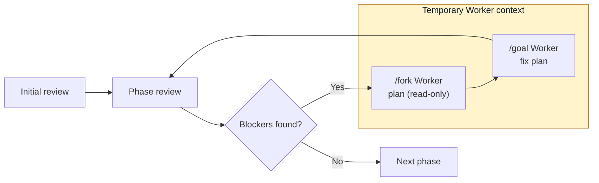

# Pre2Prod 💩→🍭

[](https://www.npmjs.com/package/pre2prod)
[](https://github.com/vv-bogdanov/pre2prod/actions/workflows/ci.yml)
[](LICENSE)

## The missing second half of vibe coding

**From a working PoC to a production-ready MVP.**

Thousands of products are vibe-coded every day. Only a small fraction make it
to production.

Getting the first version to work is fast. The long part comes next:
architecture, tests, security, observability, cleanup, and delivery.

Pre2Prod runs that work as 41 focused reviews. One GPT-5.6 Reviewer keeps the
context for the whole run. When it finds a real blocker, it forks a Codex Worker
to plan and fix it. Then the Reviewer checks the result and moves on.

```bash
npx --yes pre2prod
```

**41 reviews · 9 stages · prompts configurable in YAML**

> [!IMPORTANT]
> Pre2Prod edits your repository. Start with a clean Git tree and review every
> diff. It never deploys or touches production.

## Quick start

Requires Node.js 20.19 or newer, Git, and `codex app-server`.

```bash
cd /path/to/your/project

# Preview the available review phases.
npx --yes pre2prod --list

# Run the complete readiness workflow.
npx --yes pre2prod
```

Add project-wide direction when needed:

```bash
npx --yes pre2prod \
  "Preserve the monolith, prefer Railway, and avoid paid services"
```

## Demo

[Watch the demo on YouTube](https://youtu.be/SLOTY3L9PTE)

This is Pre2Prod running on its own repository. The video shows the real
workflow starting and moving through its reviews.

## Quick evaluation

You do not need to run all 41 reviews to test Pre2Prod. Check the local
environment and inspect the built-in workflow:

```bash
npx --yes pre2prod doctor
npx --yes pre2prod --list
```

Run one focused review inside a clean Git repository:

```bash
npx --yes pre2prod \
  -p foundation-immediate-risk-triage \
  --max-iterations 1
```

Pre2Prod modifies source code when material blockers are found. Run it only in
a clean Git repository that you are prepared to review.

## Supported platforms

- Linux (Ubuntu 24.04): tested in CI and during local dogfooding.
- macOS: should work, not tested yet.
- Windows: should work through WSL2, not tested yet.

## How it works

One Reviewer thread stays alive for the whole run and keeps what it has learned
about the repository.

If a review finds no blockers, Pre2Prod moves to the next phase. If it finds a
blocker, it forks a temporary Worker from that exact review turn. The Worker
writes a plan and executes it. The original Reviewer then reads the changed
repository and reviews it again.



The Worker transcript is never copied back into the Reviewer thread. The
Reviewer sees the changed files, not the Worker's explanation.

Optional `non_blockers` are recorded but never trigger a Worker. A phase gets
three Worker attempts by default. If blockers remain, Pre2Prod reports them and
moves on.

## Built with Codex and GPT-5.6

Pre2Prod is not one large prompt wrapped in a CLI. It uses Codex App Server
threads, turns, forks, goals, sandboxes, and structured output directly.

- One GPT-5.6 Reviewer keeps context across the run.
- Each Worker is forked from the review turn that found the blocker.
- Planning is read-only.
- Only plan execution gets workspace-write access.
- Reviewer output is split into `blockers` and informational `non_blockers`.
- The original Reviewer checks the repository again after every fix.

Pre2Prod was dogfooded on its own repository. Its checkpoint commits are visible
in the Git history.

## Usage

Common commands:

```bash
pre2prod                            # Run every selected phase
pre2prod -l                         # List phases and selection slugs
pre2prod -p foundation,architecture # Include groups or exact slugs
pre2prod -x cleanup                 # Exclude groups or exact slugs
pre2prod --no-commit                # Keep changes uncommitted
pre2prod doctor                     # Check local prerequisites
pre2prod logs --stats               # Summarize previous runs
```

Run `pre2prod --help` or `pre2prod logs --help` for the complete option list.

### Selecting phases

`--phases` (`-p`) and `--exclude` (`-x`) accept comma-separated exact slugs,
group prefixes, or repeated flags. Exclusions are applied after inclusions.

```bash
# Run two groups in their configured order.
pre2prod -p foundation,architecture

# Run exact phases.
pre2prod -p verification-core-unit-invariants,assurance-privacy-sensitive-data

# Run everything except Cleanup and one Delivery phase.
pre2prod -x cleanup,delivery-documentation-repository

# Preview the final selection without starting Codex.
pre2prod -l -p verification,assurance -x assurance-legal-compliance-readiness
```

### Controlling a run

```bash
# Work in another repository.
pre2prod -C /path/to/project

# Review one phase, inspect the diff, and commit manually.
pre2prod -p foundation-immediate-risk-triage --no-commit

# Disable network access for Worker execution tools.
pre2prod --no-network

# Change the per-phase Worker limit or turn timeout.
pre2prod --max-iterations 2 --turn-timeout 180
```

Thinking, commands, file changes, warnings, and errors stream to the terminal by
default. Use `--verbose` for additional App Server detail.

### Models and local providers

By default, Pre2Prod uses the model and provider configured in Codex. This Build
Week version was built and dogfooded with GPT-5.6. Use explicit model IDs only
when the installed Codex CLI supports them. Local providers are also supported:

```bash
pre2prod --local-provider ollama --model your-local-model
```

`--no-network` restricts Worker tools; it does not replace the provider
connection required by Codex App Server.

## Built-in review phases

```text
Foundation
  Immediate Risk Triage                   foundation-immediate-risk-triage
  Reproducible Local Run                  foundation-reproducible-local-run
  Core Scope & Critical Journeys          foundation-core-scope-critical-journeys
  Critical Smoke Baseline                 foundation-critical-smoke-baseline

Architecture
  System Shape & Dependency Boundaries    architecture-system-shape-dependency-boundaries
  Data Model & Persistence                architecture-data-model-persistence
  Dead Code & Dependency Cleanup          architecture-dead-code-dependency-cleanup
  Simplification & Deduplication          architecture-simplification-deduplication

Correctness
  Type Safety                             correctness-type-safety
  Runtime Contracts                       correctness-runtime-contracts
  Error Handling                          correctness-error-handling
  Failure Diagnostics                     correctness-failure-diagnostics
  Data Integrity & Migrations             correctness-data-integrity-migrations
  Consolidation & Cleanup                 correctness-consolidation-cleanup

Product
  UX Completeness                         product-ux-completeness
  Accessibility                           product-accessibility
  Interaction & UI Cleanup                product-interaction-ui-cleanup

Verification
  Core Unit & Invariants                  verification-core-unit-invariants
  Integration                             verification-integration
  Contracts & Compatibility               verification-contracts-compatibility
  End-to-End Critical Journeys            verification-end-to-end-critical-journeys
  Test Suite Cleanup & Stability          verification-test-suite-cleanup-stability
  Static Analysis & Formatting            verification-static-analysis-formatting

Operations
  Observability                           operations-observability
  Reliability & Operability               operations-reliability-operability
  Performance & Resource Efficiency       operations-performance-resource-efficiency
  Instrumentation & Runtime Cleanup       operations-instrumentation-runtime-cleanup

Assurance
  Application Security Hardening          assurance-application-security-hardening
  Privacy & Sensitive Data                assurance-privacy-sensitive-data
  Legal & Compliance Readiness            assurance-legal-compliance-readiness

Cleanup
  Dead Code & Unused Surface              cleanup-dead-code-unused-surface
  Dependencies, Scripts & Configuration   cleanup-dependencies-scripts-configuration
  Duplication & Consolidation             cleanup-duplication-consolidation
  Temporary, Legacy & Debug Artifacts     cleanup-temporary-legacy-debug-artifacts
  Owned Code Reduction                    cleanup-owned-code-reduction

Delivery
  CI Quality Gates                        delivery-ci-quality-gates
  Release Artifact Integrity              delivery-release-artifact-integrity
  Secure Supply Chain                     delivery-secure-supply-chain
  Deployment Readiness                    delivery-deployment-readiness
  Staging Verification                    delivery-staging-verification
  Documentation & Repository              delivery-documentation-repository
```

## Custom phases

Pre2Prod checks these paths in order. The first file found wins:

1. `<project>/.pre2prod/phases.yaml`
2. `$HOME/.pre2prod/phases.yaml`
3. bundled `resources/phases.yaml`

In the short format, each key is a review title and each value is its prompt.
The selection slug is generated from the title.

```yaml
"Architecture and maintainability": |
  Review material architectural and maintainability risks.
  Look for coupling, hidden side effects, and oversized modules.

Security: |
  Review the security posture relevant to this project.
  Focus on exploitable or materially risky gaps.
```

Need includes or custom IDs? The full object format supports both. Include paths
are relative to the YAML file and checked for cycles.

## Logs and diagnostics

Every run prints a run ID and appends to two JSONL files under `.pre2prod/logs`:

- `pre2prod-summary.jsonl` contains run and phase lifecycle events;
- `pre2prod-events.jsonl` contains detailed Reviewer, Worker, command, and
  protocol events.

```bash
# Aggregate run and phase outcomes.
pre2prod logs --stats
pre2prod logs --stats --run-id 2026-07-21-...

# Inspect selected summary or full events.
pre2prod logs --event phase.review.blockers --phase-id architecture
pre2prod logs --full --role worker --turn execution
```

The logs redact common secrets. Each file is capped at 10 MiB; old complete
records are dropped first. If logging fails, Pre2Prod prints a warning and keeps
the real command result.

Before a long run, verify the complete local path with:

```bash
pre2prod doctor -C .
```

## Git and safety

- Git is required. A missing repository fails with an instruction to run
  `git init`.
- The working tree must be clean; Pre2Prod never stashes, resets, or cleans user
  changes.
- By default, Pre2Prod creates `pre2prod/<timestamp>` and commits each phase
  checkpoint. `--no-commit` keeps changes on the current branch.
- Reviewer turns are read-only. Only Worker execution turns receive
  workspace-write access.
- Plans and default logs are excluded through `.git/info/exclude`, not by
  modifying the project's `.gitignore`.
- Pre2Prod does not deploy, promote, migrate, or operate production systems.

## Data and privacy

Codex needs to read the repository. Pre2Prod sends the context required for each
turn to the provider configured in Codex. That provider's terms and retention
rules apply. Do not run it on source or data you are not allowed to share.

Pre2Prod itself sends no analytics. Logs, plans, and reports stay under
`.pre2prod`; delete that directory when you no longer need them.

## Troubleshooting

- **Codex authentication, model, or sandbox errors:** run `pre2prod doctor`,
  inspect `pre2prod logs`, and consult
  [`docs/LIVE_COMPATIBILITY_CHECKLIST.md`](docs/LIVE_COMPATIBILITY_CHECKLIST.md).
- **Long-running turns:** increase `--turn-timeout`; the default is 120 minutes.
- **Dirty working tree:** commit or stash changes. Pre2Prod never does this
  automatically.
- **`ERR_PNPM_NO_GLOBAL_BIN_DIR`:** run `pnpm setup`, restart the shell, and
  confirm `PNPM_HOME` is on `PATH`. During development, use `node dist/cli.js`
  if global linking remains unavailable.

## Project documentation

- [Architecture](docs/ARCHITECTURE.md)
- [Live Codex compatibility checklist](docs/LIVE_COMPATIBILITY_CHECKLIST.md)
- [Contributing](CONTRIBUTING.md)
- [Releasing](RELEASING.md)
- [Security policy](SECURITY.md)

Report suspected vulnerabilities through GitHub's private vulnerability
reporting channel as described in `SECURITY.md`. Never include credentials or
private repository material in a public issue.

## Development

```bash
corepack enable
pnpm install --frozen-lockfile
pnpm run build
node dist/cli.js --list
```

In a source checkout, `bin/pre2prod.js` rebuilds TypeScript automatically before
each run. `pnpm run link` installs the current checkout as a global development
command. `dev.env` can define development-only provider and model defaults; CLI
flags take precedence.

Run the complete CI and package release gate before committing:

```bash
pnpm run release:check
```

This runs formatting, typechecking, linting, coverage, build, production
dependency audit, tarball creation, clean installation, and installed CLI
smoke testing.
