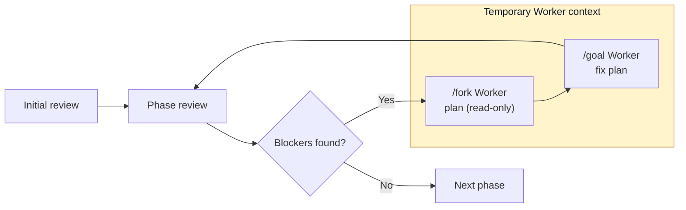

# pre2prod 💩→🍭

[](https://www.npmjs.com/package/pre2prod)
[](https://github.com/vv-bogdanov/pre2prod/actions/workflows/ci.yml)
[](LICENSE)

**A reviewer-led Codex CLI that turns an existing repository into a
production-ready MVP, one readiness phase at a time.**

Pre2prod reviews the real repository, fixes material gaps through temporary
Worker agents, verifies every change independently, and records phase
checkpoints in Git. It is noninteractive and adapts its checks to the project's
actual language, framework, architecture, and scale.

> [!IMPORTANT]
> Pre2prod requires a clean Git repository and an installed, authenticated Codex
> CLI. It changes source code, but never deploys or performs destructive
> production operations. Review the resulting diff before using it in staging.

## Quick start

Requires Node.js 20.19 or newer, Git, and `codex app-server`.

```bash
cd /path/to/your/project

# Preview the available review phases.
npx --yes pre2prod --list

# Run the complete readiness workflow.
npx --yes pre2prod
```

Add project-wide direction when needed:

```bash
npx --yes pre2prod \
  "Preserve the monolith, prefer Railway, and avoid paid services"
```

## How it works

Pre2prod keeps one Reviewer thread for the entire run. A phase with no blockers
passes immediately. Material blockers fork a temporary Worker from the exact
review turn; that Worker plans in read-only mode, receives a goal, applies the
plan, and returns control to the persistent Reviewer.



The Worker transcript is never merged back into the Reviewer context. The
Reviewer independently re-reads the changed repository. Optional
`non_blockers` never trigger a Worker.

By default, a phase gets up to three Worker iterations. If blockers remain,
Pre2prod warns, records the unresolved findings, and continues to the next
phase so the final summary can identify phases worth rerunning.

## Usage

Common commands:

```bash
pre2prod                            # Run every selected phase
pre2prod -l                         # List phases and selection slugs
pre2prod -p foundation,architecture # Include groups or exact slugs
pre2prod -x cleanup                 # Exclude groups or exact slugs
pre2prod --no-commit                # Keep changes uncommitted
pre2prod doctor                     # Check local prerequisites
pre2prod logs --stats               # Summarize previous runs
```

Run `pre2prod --help` or `pre2prod logs --help` for the complete option list.

### Selecting phases

`--phases` (`-p`) and `--exclude` (`-x`) accept comma-separated exact slugs,
group prefixes, or repeated flags. Exclusions are applied after inclusions.

```bash
# Run two groups in their configured order.
pre2prod -p foundation,architecture

# Run exact phases.
pre2prod -p verification-core-unit-invariants,assurance-privacy-sensitive-data

# Run everything except Cleanup and one Delivery phase.
pre2prod -x cleanup,delivery-documentation-repository

# Preview the final selection without starting Codex.
pre2prod -l -p verification,assurance -x assurance-legal-compliance-readiness
```

### Controlling a run

```bash
# Work in another repository.
pre2prod -C /path/to/project

# Review one phase, inspect the diff, and commit manually.
pre2prod -p foundation-immediate-risk-triage --no-commit

# Disable network access for Worker execution tools.
pre2prod --no-network

# Change the per-phase Worker limit or turn timeout.
pre2prod --max-iterations 2 --turn-timeout 180
```

Thinking, commands, file changes, warnings, and errors stream to the terminal by
default. Use `--verbose` for additional App Server detail.

### Models and local providers

Without flags, Pre2prod uses the model and provider configured by Codex. A model
or supported local provider can be selected explicitly:

```bash
pre2prod --model gpt-5.3-codex
pre2prod --local-provider ollama --model your-local-model
```

`--no-network` restricts Worker tools; it does not replace the provider
connection required by Codex App Server.

## Built-in review phases

```text
Foundation
  Immediate Risk Triage
  Reproducible Local Run
  Core Scope & Critical Journeys
  Critical Smoke Baseline
Architecture
  System Shape & Dependency Boundaries
  Data Model & Persistence
  Dead Code & Dependency Cleanup
  Simplification & Deduplication
Correctness
  Type Safety
  Runtime Contracts
  Error Handling
  Failure Diagnostics
  Data Integrity & Migrations
  Consolidation & Cleanup
Product
  UX Completeness
  Accessibility
  Interaction & UI Cleanup
Verification
  Core Unit & Invariants
  Integration
  Contracts & Compatibility
  End-to-End Critical Journeys
  Test Suite Cleanup & Stability
  Static Analysis & Formatting
Operations
  Observability
  Reliability & Operability
  Performance & Resource Efficiency
  Instrumentation & Runtime Cleanup
Assurance
  Application Security Hardening
  Privacy & Sensitive Data
  Legal & Compliance Readiness
Cleanup
  Dead Code & Unused Surface
  Dependencies, Scripts & Configuration
  Duplication & Consolidation
  Temporary, Legacy & Debug Artifacts
  Owned Code Reduction
Delivery
  CI Quality Gates
  Release Artifact Integrity
  Secure Supply Chain
  Deployment Readiness
  Staging Verification
  Documentation & Repository
```

## Custom phases

Pre2prod uses the first `phases.yaml` found in this order:

1. `<project>/.pre2prod/phases.yaml`
2. `$HOME/.pre2prod/phases.yaml`
3. bundled `resources/phases.yaml`

The compact format maps each phase title to a multiline Reviewer prompt. Its
selection slug is derived from the title.

```yaml
"Architecture and maintainability": |
  Review material architectural and maintainability risks.
  Look for coupling, hidden side effects, and oversized modules.

Security: |
  Review the security posture relevant to this project.
  Focus on exploitable or materially risky gaps.
```

The full format additionally supports `include`, an explicit `phases` list,
custom IDs, and object-style phase definitions. Includes are resolved relative
to the YAML file and checked for cycles.

## Logs and diagnostics

Every run prints its run ID and writes two bounded JSONL logs under
`.pre2prod/logs`:

- `pre2prod-summary.jsonl` contains run and phase lifecycle events;
- `pre2prod-events.jsonl` contains detailed Reviewer, Worker, command, and
  protocol events.

```bash
# Aggregate run and phase outcomes.
pre2prod logs --stats
pre2prod logs --stats --run-id 2026-07-21-...

# Inspect selected summary or full events.
pre2prod logs --event phase.review.blockers --phase-id architecture
pre2prod logs --full --role worker --turn execution
```

Logs are redacted before persistence and limited to 10 MiB per file by
retaining complete recent records. A logging failure emits a warning but does
not replace the terminal result.

Before a long run, verify the complete local path with:

```bash
pre2prod doctor -C .
```

## Git and safety

- Git is required. A missing repository fails with an instruction to run
  `git init`.
- The working tree must be clean; Pre2prod never stashes, resets, or cleans user
  changes.
- By default, Pre2prod creates `pre2prod/<timestamp>` and commits each phase
  checkpoint. `--no-commit` keeps changes on the current branch.
- Reviewer turns are read-only. Only Worker execution turns receive
  workspace-write access.
- Plans and default logs are excluded through `.git/info/exclude`, not by
  modifying the project's `.gitignore`.
- Pre2prod does not deploy, promote, migrate, or operate production systems.

## Data and privacy

Pre2prod sends repository material, prompts, and tool context required for each
turn to the selected Codex or local model provider. Provider-side processing
and retention follow that provider's configuration and terms. Do not run it on
source or data you are not authorized to share.

Pre2prod itself has no analytics service. Local diagnostics stay under
`.pre2prod`; remove that directory when its logs, plans, and reports are no
longer needed.

## Troubleshooting

- **Codex authentication, model, or sandbox errors:** run `pre2prod doctor`,
  inspect `pre2prod logs`, and consult
  [`docs/LIVE_COMPATIBILITY_CHECKLIST.md`](docs/LIVE_COMPATIBILITY_CHECKLIST.md).
- **Long-running turns:** increase `--turn-timeout`; the default is 120 minutes.
- **Dirty working tree:** commit or stash changes. Pre2prod never does this
  automatically.
- **`ERR_PNPM_NO_GLOBAL_BIN_DIR`:** run `pnpm setup`, restart the shell, and
  confirm `PNPM_HOME` is on `PATH`. During development, use `node dist/cli.js`
  if global linking remains unavailable.

## Project documentation

- [Architecture](docs/ARCHITECTURE.md)
- [Live Codex compatibility checklist](docs/LIVE_COMPATIBILITY_CHECKLIST.md)
- [Contributing](CONTRIBUTING.md)
- [Releasing](RELEASING.md)
- [Security policy](SECURITY.md)

Report suspected vulnerabilities through GitHub's private vulnerability
reporting channel as described in `SECURITY.md`. Never include credentials or
private repository material in a public issue.

## Development

```bash
corepack enable
pnpm install --frozen-lockfile
pnpm run build
node dist/cli.js --list
```

In a source checkout, `bin/pre2prod.js` rebuilds TypeScript automatically before
each run. `pnpm run link` installs the current checkout as a global development
command. `dev.env` can define development-only provider and model defaults; CLI
flags take precedence.

Run the complete CI and package release gate before committing:

```bash
pnpm run release:check
```

This runs formatting, typechecking, linting, coverage, build, production
dependency audit, tarball creation, clean installation, and installed CLI
smoke testing.

## TODO

- Move shared Reviewer and Worker prompts into layered, overridable YAML
  resources.
- Decide how Reviewer `non_blockers` should be retained or surfaced. They must
  remain informational and must not be sent to the Worker.
- Resume interrupted runs from the last safe phase or turn boundary without
  replaying a Worker side effect whose completion is unknown.
- Add npm trusted publishing after the initial manual release.
